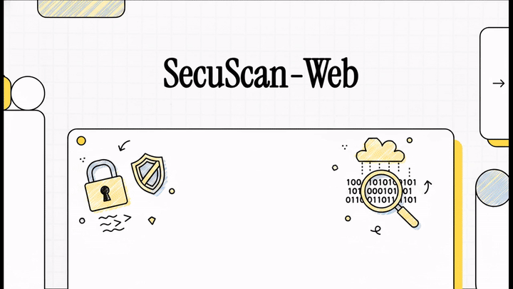

# SecuScan Web

## Démonstration



[▶ Voir la démonstration complète](https://github.com/heiphaistos44-crypto/SecuScan-AppWeb/raw/main/assets/demo.mp4)


Version web de [SecuScan](https://github.com/heiphaistos44-crypto/SecuScan) — analyse de sécurité du code (SAST), des secrets et des binaires, en ligne.

**Prod : https://secuscan.heiphaistos.org**

## Fonctionnement

Uploadez **un fichier** (code source, script, config, binaire PE) **ou un ZIP de projet entier** → analyse récursive → rapport de vulnérabilités classées par sévérité, avec remédiation et hints de faux positifs.

## Architecture

- `server/` — Rust **axum** : API + frontend statique. Réutilise les parsers du desktop v1.0.5 (`sast`, `script`, `config`, `binary`) + modèles + export, **sans Tauri ni LLM ni keystore**.
- `web/` — **Vue 3 + Vite** : dropzone, stats sévérité filtrables, table de vulnérabilités, export JSON.
- Scan en répertoire temporaire isolé, **supprimé immédiatement après** (RAII).

### Détections (identiques au desktop)
- **SAST** : injection SQL, XSS, command injection, path traversal, désérialisation, crypto faible, CORS, open redirect, secrets en dur
- **Scripts** : obfuscation, élévation de privilèges, désactivation AV, download de payload, exécution arbitraire
- **Config/secrets** : clés API, mots de passe, JWT, chaînes de connexion, chaînes haute entropie
- **Binaires PE** : ASLR/DEP manquants, signature, + **YARA** (injection DLL, process hollowing, persistance, ransomware, shellcode)
- **Hints de faux positifs** : contexte test/exemple/placeholder, MD5 checksum vs password, etc.

### API

| Route | Méthode | Détail |
|-------|---------|--------|
| `/api/scan` | POST | multipart `file` (fichier ou ZIP) → ScanResult JSON |
| `/api/health` | GET | `{status, version}` |

### Protections (accès public)

- Upload max **80 MB**
- **Anti zip-slip** (chemins `..`/absolus rejetés) + **anti zip-bomb** (600 MB décompressés / 20k entrées max)
- Rate-limit **8 scans/min/IP**, max **2 scans simultanés**, timeout 180 s
- Cap 512 KB par fichier pour les regex, timeout 10 s par fichier
- Fichiers jamais conservés (temp dir supprimé après scan)
- Écoute `127.0.0.1:3005` (exposé via nginx)

## Dev local

```bash
cd server && cargo run                 # backend :3005
cd web && npm install && npm run dev   # frontend :1423 (proxy /api)
```

## Déploiement VPS (212.227.140.45)

```bash
# 1. Build frontend local : cd web && npm run build
# 2. Sync vers /opt/secuscan puis :
cd /opt/secuscan && bash deploy/deploy.sh

# 3. nginx (une fois) :
cp deploy/nginx-secuscan.conf /etc/nginx/sites-available/secuscan
ln -s /etc/nginx/sites-available/secuscan /etc/nginx/sites-enabled/
nginx -t && systemctl reload nginx
certbot --nginx -d secuscan.heiphaistos.org --non-interactive --agree-tos --redirect

# 4. DNS Ionos : A secuscan → 212.227.140.45
```

## Versions

- **1.0.0** (2026-06-12) — portage web depuis SecuScan desktop v1.0.5 (parsers/export réutilisés, scan ZIP ajouté)
